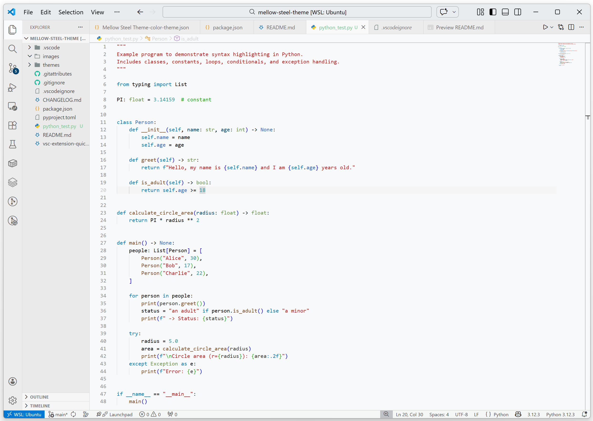
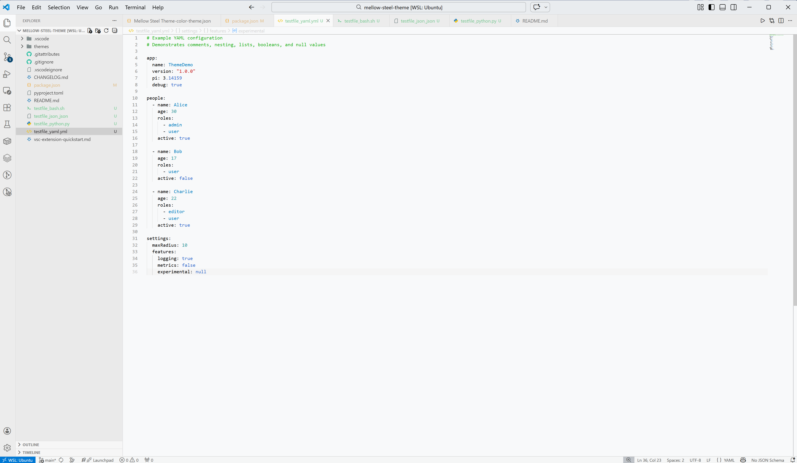
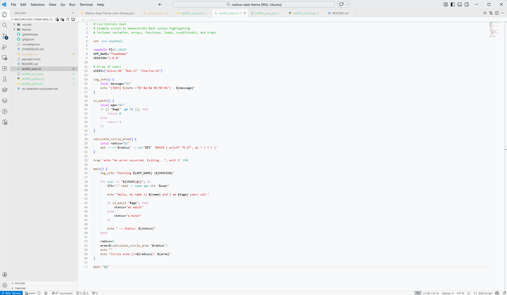
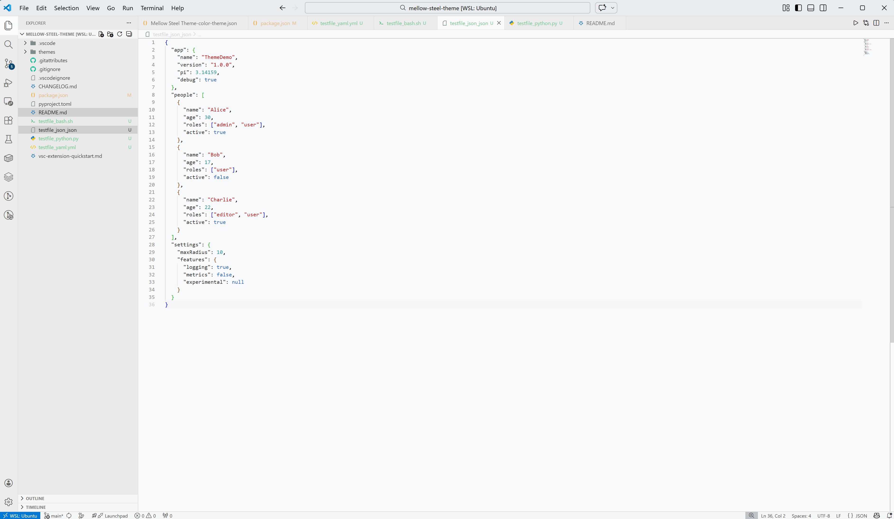

# Mellow Steel Theme

A sophisticated, metallic-inspired interface designed for clarity, focus, and visual longevity.

---

**Mellow Steel** is a sleek, high-contrast dark theme meticulously crafted for the modern developer. While it excels across all environments, it is **specifically optimized for Python developers**, offering a refined syntax palette that makes decorators, dunder methods, and complex logic stand out against a calm, steel-gray backdrop.

Reduce eye strain and maintain your flow with a workspace that feels like a precision-engineered instrument.

---

### ⚠️ Disclaimer
**Active Development:** This theme is currently in active development. Visual elements may be refined in future updates to ensure the best possible coding experience.

### 🔗 Project Information
*   [Change Log](CHANGELOG.md) — *Detailed history of updates and fixes.*
*   [Project Configuration](project.toml) — *Build system and metadata.*
*   [Package Manifest](package.json) — *Technical requirements and contributions.*

---

### 💡 Pro-Tip: Optimized Environment
To get the full experience and the intended "Mellow Steel" feel, we recommend adding the following settings to your `settings.json`. These adjustments ensure that the terminal and editor UI align perfectly with the theme's aesthetic:

```json
{
    "terminal.integrated.cursorStyle": "line",
    "terminal.integrated.cursorBlinking": true,
    "terminal.integrated.fontFamily": "DroidSansMono NF",
    "terminal.integrated.defaultProfile.linux": "bash",
    "terminal.integrated.initialHint": false,
    "window.zoomLevel": -2,
    "workbench.startupEditor": "none",
    "workbench.iconTheme": "easy-icons",
    "chat.viewSessions.orientation": "stacked",
    "editor.acceptSuggestionOnEnter": "off",
    "editor.acceptSuggestionOnCommitCharacter": false,
    "editor.bracketPairColorization.enabled": true,
    "editor.fontSize": 14,
    "editor.inlineSuggest.edits.allowCodeShifting": "never",
    "editor.inlineSuggest.enabled": false,
    "editor.semanticHighlighting.enabled": false
}
```

### Light Steel Theme

**Python**


**Yaml**


**Bash**


**Json**

